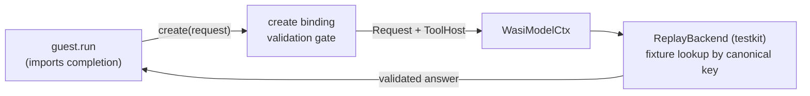

# Model completion (replay)

Proves the replay seam of the `wasi-model` boundary: a guest calls `create` across the `omnia:model/completion` boundary and receives a **validated, deterministic** answer from the testkit replay backend — no live model, no network.

## What it shows

- `guest` ([`guest.rs`](guest.rs)) **imports** `omnia:model/completion` and exposes an async `run`. It builds a `json-schema` prompt, assembling the `system` / `messages` channels with the guest-side `Sections` builder (role / task / context), sets `grants.references = "shelf"` as data, reads the preopen table via `wasi:filesystem/preopens` and lends the workspace named `.` through `grants.workspace`, then calls `create(request).await`.
- [`runtime.rs`](runtime.rs) binds the `WasiModel` host to an example-local backend that embeds the checked-in fixture at compile time and serves it through `omnia_testkit::model::ReplayBackend` — the replay backend that answers an equivalent prompt with the recorded answer.
- [`omnia.toml`](omnia.toml)'s `[[mount]]` preopens the repo root as a read-only workspace named `.`. The host resolves the lent descriptor back to that mount by directory identity; the replay backend ignores it (replay short-circuits tools).
- [`fixtures/`](fixtures) holds the checked-in replay fixture: the reduced, canonical prompt (the key) mapped to the validated answer.



The runtime core stays generic (Law 2): no model id, provider, or schema dialect lives in Omnia. The boundary only ever hands the guest a **validated answer string**. The replay backend short-circuits tool calls, so this binary never emits a `resolve`; the host→guest `resolve` path is exercised deterministically by the seam suite, and live by the `omnia-genai` backend in the `backends` repo.

## Quick Start

```bash
make build model
```

Or, more manually, for debugging:

```bash
# build the guest
cargo build -p examples --example model-wasm --target wasm32-wasip2
```

This emits `target/wasm32-wasip2/debug/examples/model_wasm.wasm` (the underscored name the manifest points at).

## Run

The fixture is embedded in the runtime binary, so no configuration is needed:

```bash
export RUST_LOG=info,opentelemetry_sdk=off
cargo run --example model -- run --config examples/model/omnia.toml
```

Because the guest exports a plain async `run` (not an HTTP/messaging trigger), the end-to-end completion is exercised by the seam suite rather than inbound traffic:

```bash
# after `cargo make test-guests` (do NOT `cargo clean` in between):
cargo test -p omnia-seam-suite --test seam model
```

The `replay` scenario replays the guest through the testkit `ReplayBackend` from the committed fixture — asserting the validated answer returns with no network. The `workspace` scenario drives a stub backend proving the host resolves the guest's lent workspace to its mount path, and `default_backend_rejects_schema_format` proves the in-tree echo `ModelDefault` starts with zero configuration but rejects this guest's `format::schema` request — no network, fully in CI.

## Updating the fixture

If you change the guest's prompt, update the checked-in fixture under [`fixtures/`](fixtures) manually so its `key_request` matches the guest's reduced, canonical request (the assembled `system` / `messages` channels, not the pre-assembly template). Alternatively, wrap a live backend in `omnia_testkit::model::RecorderBackend` to regenerate the row from a real run.
