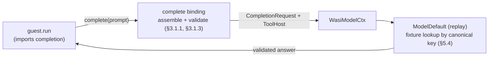

# Model completion (replay)

Proves **Phase 1** of [`rfcs/wasi-model.md`](../../rfcs/wasi-model.md) (§6, run 1): a guest calls `complete` across the `augentic:model/completion` boundary and receives a **validated, deterministic** answer from the in-tree `ModelDefault` (replay) backend — no live model, no network.

## What it shows

- `guest` ([`guest.rs`](guest.rs)) **imports** `augentic:model/completion` and exposes an async `run`. It builds a `json-schema` prompt from `sections` (role / task / context), sets `grants.references = "shelf"` as data, reads the preopen table via `wasi:filesystem/preopens` and lends the working tree named `.` through `grants.working-tree`, then calls `complete(prompt).await`.
- [`runtime.rs`](runtime.rs) binds the `WasiModel` host to `ModelDefault`, the replay backend that serves a recorded answer for an equivalent prompt.
- [`omnia.toml`](omnia.toml)'s `[[mount]]` preopens the repo root as a read-only working tree named `.` (RFC-55). The host resolves the lent descriptor back to that mount by directory identity; the replay backend then ignores it (Phase 1 short-circuits tools), so the only trace in the fixture is the stable `working_tree_lent = true` marker.
- [`shelf.rs`](shelf.rs) is the `references` shelf (Phase 2a): it exports `resolve` and is reached *only* via host-mediated dispatch when a backend follows `grants.references` (instance-per-call, no trigger). It is inert under the replay backend; the resolve path is proven by the integration test.
- [`omnia.toml`](omnia.toml) declares the `model` guest and the `shelf` guest.
- [`fixtures/`](fixtures) holds the checked-in replay fixture: the reduced, canonical prompt (the key) mapped to the validated answer.



The runtime core stays generic (Law 2): no model id, provider, or schema dialect lives in Omnia. The boundary only ever hands the guest a **validated answer string**. The replay backend short-circuits tool calls, so this binary never emits a `resolve`; the host→guest `resolve` path (a fresh `shelf` instance per call) is exercised deterministically by the integration test, and live by the `omnia-genai` backend in the `backends` repo (Phase 2a).

## Build the guests

A whole-workspace `wasm32-wasip2` build fails on the native-only host crates, so build the guest components explicitly:

```bash
cargo build -p examples --example model-wasm --example model-shelf-wasm --target wasm32-wasip2
```

This emits `target/wasm32-wasip2/debug/examples/model_wasm.wasm` and `model_shelf_wasm.wasm` (the underscored names the manifest points at).

## Run

Point `OMNIA_REPLAY_DIR` at the checked-in fixtures and start the host:

```bash
OMNIA_REPLAY_DIR=examples/model/fixtures \
  cargo run --example model -- run --config examples/model/omnia.toml
```

Because the guest exports a plain async `run` (not an HTTP/messaging trigger), the end-to-end completion is exercised by the integration test rather than inbound traffic:

```bash
# after building the guest above (do NOT `cargo clean` in between):
cargo nextest run -p omnia-wasi-model --test replay
```

The test records the guest's prompt through a stub backend, replays it through `ModelDefault`, and finally replays it from the committed fixture — asserting the validated answer returns with no network. A second test (`resolve` path) drives a stub backend that calls `tool_host.resolve` for the `grants.references = "shelf"` prompt, proving the host→guest dispatch reaches a **fresh `shelf` instance per call** and the bytes round-trip — no network, fully in CI.

## Regenerate the fixture

If you change the guest's prompt, refresh the checked-in fixture from the live guest:

```bash
cargo build -p examples --example model-wasm --target wasm32-wasip2
cargo test -p omnia-wasi-model --test replay -- --ignored record_example_fixture
```
