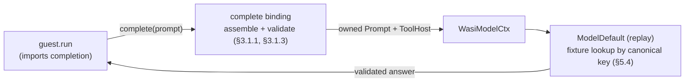

# Model completion (replay)

Proves **Phase 1** of [`rfcs/wasi-model.md`](../../rfcs/wasi-model.md) (§6, run 1):
a guest calls `complete` across the `augentic:model/completion` boundary and
receives a **validated, deterministic** answer from the in-tree `ModelDefault`
(replay) backend — no live model, no network.

## What it shows

- `guest` ([`guest.rs`](guest.rs)) **imports** `augentic:model/completion` and
  exposes an async `run`. It builds a `json-schema` prompt from `sections`
  (role / task / context), sets `grants.references = "shelf"` as data, and calls
  `complete(prompt).await`.
- [`runtime.rs`](runtime.rs) binds the `WasiModel` host to `ModelDefault`, the
  replay backend that serves a recorded answer for an equivalent prompt.
- [`omni.toml`](omni.toml) declares the single `model` guest.
- [`fixtures/`](fixtures) holds the checked-in replay fixture: the reduced,
  canonical prompt (the key) mapped to the validated answer.



The floor stays generic (Law 2): no model id, provider, or schema dialect lives
in Omnia. The boundary only ever hands the guest a **validated answer string** —
replay short-circuits any tool calls, so no `resolve` (and no `shelf` guest) is
exercised in Phase 1; that lands in Phase 2a.

## Build the guest

A whole-workspace `wasm32-wasip2` build fails on the native-only host crates, so
build the guest component explicitly:

```bash
cargo build -p examples --example model-wasm --target wasm32-wasip2
```

This emits `target/wasm32-wasip2/debug/examples/model_wasm.wasm` (the underscored
name the manifest points at).

## Run

Point `OMNI_REPLAY_DIR` at the checked-in fixtures and start the host:

```bash
OMNI_REPLAY_DIR=examples/model/fixtures \
  cargo run --example model -- run --config examples/model/omni.toml
```

Because the guest exports a plain async `run` (not an HTTP/messaging trigger),
the end-to-end completion is exercised by the integration test rather than
inbound traffic:

```bash
# after building the guest above (do NOT `cargo clean` in between):
cargo nextest run -p omnia-wasi-model --test replay
```

The test records the guest's prompt through a stub backend, replays it through
`ModelDefault`, and finally replays it from the committed fixture — asserting the
validated answer returns with no network.

## Regenerate the fixture

If you change the guest's prompt, refresh the checked-in fixture from the live
guest:

```bash
cargo build -p examples --example model-wasm --target wasm32-wasip2
cargo test -p omnia-wasi-model --test replay -- --ignored record_example_fixture
```
