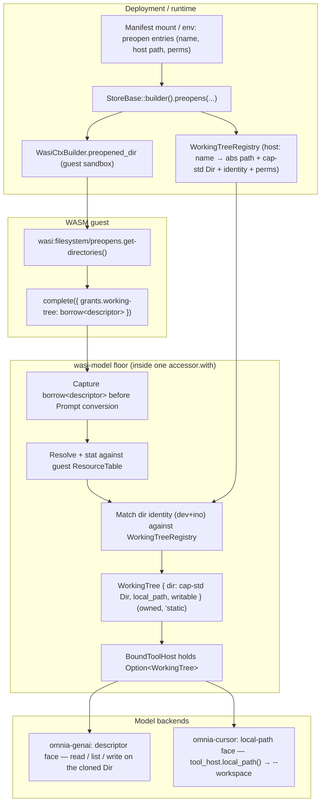

# RFC-55: Working-Tree Host

> Status: Draft · Order 3 of 10 · Depends: the `wasi-model` boundary (`augentic:model@0.1.0`), `wasi:filesystem@0.3.0` (p3, via `wasmtime-wasi`) · Enables: [RFC-59](working-tree.md) (genai tool loop), [wasi-model](wasi-model.md) §3 (floor `ToolHost` wiring), `omnia-cursor` descriptor resolution · Owns: the host-side working-tree capability — preopens, the `descriptor` / `local-path` faces, and the runtime configuration that binds a guest to a node-local tree

## Abstract

Model completions that read or edit source code need access to a **working tree** on disk. The `wasi-model` boundary lends a `wasi:filesystem/types.descriptor` through `prompt.grants.working-tree` — never an OS path string. This RFC builds that capability on **p3** (`wasi:filesystem@0.3.0`, `wasmtime_wasi::p3`), aligning with the runtime's p3 direction (the base linker already wires `wasmtime_wasi::p3::add_to_linker`, `crates/omnia/src/create.rs`, and the CLI trigger is p3, `wasi-cli-alignment.md`). That choice re-cuts the boundary WIT from its `0.2.12` placeholder to `0.3.0` (see [The lent capability](#the-lent-capability-grantsworking-tree)); the remaining work is the **host plumbing** that (1) preopens a bounded directory into the guest's WASI sandbox, (2) lets the guest pass that descriptor into `complete`, and (3) resolves it on the host side for two consumers:

- **Mediated access** — the genai backend's in-process `read` / `list` / `write` tools (RFC-59), which must never expose a path or raw descriptor to the model.
- **Direct native access** — the spawned `cursor-agent` backend, which needs a real filesystem path for `--workspace`.

This RFC defines the working-tree host: how preopens are declared, how the lent descriptor is validated and resolved, and how the two faces are exposed without breaking the sandbox invariant.

## Problem

Today:

1. **`StoreBase` preopens nothing.** `WasiCtxBuilder` inherits env and stdio but mounts no directories (`crates/omnia/src/store.rs`), so guests have no filesystem descriptor to lend.
2. **The floor drops the descriptor.** The WIT→owned `Prompt` conversion reduces `grants.working-tree` to a boolean `working_tree_lent` marker; the resource-table handle is never captured (`crates/wasi-model/src/host/types.rs`).
3. **`ToolHost::read` / `list` / `write` are loud stubs** that fail until Phase 2b (`crates/wasi-model/src/host/model_impl.rs`).
4. **`omnia-cursor` uses a config stopgap.** `OMNIA_WORKSPACE` supplies the workspace path instead of resolving the lent descriptor's `local-path` face (`backends/crates/cursor`).

The replay keying (`working_tree_lent: bool`) is already correct and is unaffected by the binding version. The remaining gap is a **boundary revision plus capability plumbing**: the `model.wit` descriptor `use` moves from `wasi:filesystem/types@0.2.12` to `@0.3.0`, the bindgen `with:` remap moves from `wasmtime_wasi::p2::bindings::filesystem` to `wasmtime_wasi::p3::bindings::filesystem` (owned by [wasi-model](wasi-model.md) §3), and the host plumbing below is built on the p3 descriptor.

## Design overview



### Core invariant

**Guests select; hosts supply.** A guest never embeds an absolute path in the prompt. The lent `descriptor` is a *selector and authorizer*: the host resolves it against the guest's `ResourceTable`, then matches its directory identity against the **`WorkingTreeRegistry`** the deployment built when it configured preopens. The registry — not the descriptor — supplies the resolved faces: a cap-std `Dir` for bounded operations (genai) and the absolute host `Path` (cursor). This split is forced by the platform: a `wasi:filesystem` `Descriptor` is backed by a `cap_std::fs::Dir`, which is **path-less by design** (cap-std exposes no API to recover a host path from a `Dir`), so the absolute path *must* come from host config keyed by the descriptor, never extracted from it. The model never sees either face.

## The lent capability (`grants.working-tree`)

The authoritative shape is in `crates/wasi-model/wit/model.wit`:

```wit
record tool-grants {
    references: option<string>,
    working-tree: option<borrow<descriptor>>,
    verify: list<string>,
}
```

Properties:

- **`borrow<descriptor>`** — not an integer handle the guest could forge. The floor resolves it from the guest's `ResourceTable` exactly as other WASI hosts resolve typed resources.
- **Version `wasi:filesystem@0.3.0` (p3)** — `model.wit` uses `wasi:filesystem/types@0.3.0.{descriptor}`, and the `wasi-model` bindgen `with:` remaps `wasi:filesystem` (and the transitive `wasi:clocks`) onto `wasmtime_wasi::p3::bindings`, so the WIT type is the same p3 `Descriptor` the runtime serves. p3 filesystem replaces p2's `wasi:io`-stream reads with native component-model-async `stream`/`future`, so the `wasi:io` remap and vendored `io.wit` dep that p2 required are no longer pulled in by `filesystem/types`. The guest gets a p3 descriptor from p3 `preopens.get-directories()`; the borrow stays binding-consistent end to end.
- **p3 is experimental.** In `wasmtime-wasi` 46 the `p3` module is explicitly "experimental, unstable and incomplete … not ready for production use," and p3-only bug/security fixes are not guaranteed patch releases. Resting a capability-security boundary on it is a deliberate bet on the runtime's p3 direction; pin the `wasmtime-wasi` `46.0.x` patch line and treat a p3 break as a blocking upstream dependency (see [Risks](#risks-and-invariants)).
- **Replay keying** — the descriptor does not survive into fixtures; only `working_tree_lent: bool` is recorded (`crates/wasi-model/src/host/replay.rs` §5.4).

## Two faces on one tree

The working-tree host exposes the **same** underlying directory through two host-only interfaces. Neither face is guest-importable WIT; both are surfaced on the host-only [`ToolHost`](#floor-wiring-wasi-model-phase-2b) trait when a completion is in flight, so neither can leak into the serializable `Prompt` or a replay fixture.

| Face | `ToolHost` surface | Consumer | Semantics |
| --- | --- | --- | --- |
| **`descriptor`** | `read` / `list` / `write` | `wasi-model` floor tools (genai) | Relative-path operations bounded to the resolved cap-std `Dir`. cap-std path-resolution rules are the floor (`..` and symlinks escaping the base fail with `not-permitted`); the host never sees nor returns an OS path. |
| **`local-path`** | `local_path() -> Option<&Path>` | Native backends (`omnia-cursor`, future verify sandboxes) | The absolute host `Path` of the matched preopen *root*, supplied from the `WorkingTreeRegistry`. Host-only: never returned to the guest, never serialized, never surfaced in a model tool result. |

Genai uses the **descriptor** face exclusively: the model calls tools with relative paths; the floor executes them against the resolved cap-std `Dir`. Cursor uses the **local-path** face: it calls `tool_host.local_path()`, spawns `cursor-agent --workspace <path>`, and lets the agent own its tool loop.

### How the descriptor selects a face

cap-std deliberately strips host paths from descriptors, so the host cannot read a path *out of* the lent `descriptor`. Instead the descriptor is matched **back to** the registry entry that produced it, by **directory identity** — the `(device, inode)` pair on Unix (and the platform file-id on Windows), read via `cap_std::fs::Dir` metadata. The registry then supplies both faces for the matched entry. This is the only mechanism that yields an absolute path while honouring the capability model.

**Phase 1: only a preopen *root* is lendable.** A guest may scope a sub-tree with `descriptor.open-at`, but a sub-descriptor has no registry entry and no recoverable host path, so it cannot back the `local-path` face. To keep the two faces in lock-step and to make acceptance criterion #2 enforceable, Phase 1 requires the lent descriptor to *identity-match* an authorized preopen root; a sub-tree (or any unauthorized directory) is rejected at `complete` time as out-of-scope. Per-completion sub-tree scoping for the genai-only `descriptor` face is a documented follow-up, not a Phase-1 capability.

Both faces therefore resolve to the **same** registry entry for a given completion. Lending a descriptor that matches no authorized preopen is a host error at `complete` time, raised at the floor, never inside a backend.

## Runtime preopens

Before a guest can lend a tree, the host must mount it.

### Current behaviour

`StoreBase::builder().build()` constructs:

```rust
WasiCtxBuilder::new()
    .inherit_env()
    .inherit_stdin()
    .stdout(...)
    .stderr(...)
    .args(...)
    .build()
```

No `.preopened_dir(...)` calls exist. The base linker already links both WASI generations (`create.rs` calls `wasmtime_wasi::p2::add_to_linker_async` *and* `wasmtime_wasi::p3::add_to_linker`, lines 159–160), so the p3 filesystem host that serves the descriptor face is wired — but inert without preopens.

### Required behaviour

The preopen path follows the **exact shape the landed argv path already established** for the CLI alignment (`wasi-cli-alignment.md` §5.3): a deployment-config input parsed into the manifest, threaded into the store through one new `StoreBaseBuilder` setter, and applied in `build()`. Where argv flows `manifest → #[runtime(args)] → StoreBase::builder().args(&self.args) → WasiCtxBuilder::args`, a working-tree mount flows `manifest → #[runtime(preopens)] → StoreBase::builder().preopens(&self.preopens) → WasiCtxBuilder::preopened_dir` **plus** a parallel `WorkingTreeRegistry`.

1. **Declare mount points** at deployment time. The manifest is the home (it already owns guest population, routing, and transport, and is parsed generically — `crates/omnia/src/manifest.rs`); a single env shorthand (`OMNIA_WORKING_TREE=<abs path>`) covers the single-guest "review this repo" case. Each entry specifies:
   - Host path (absolute, or relative to the manifest base, resolved exactly as `[[guest]]` `source.path` is — `manifest.rs::sources`)
   - Guest-visible name (the string `preopens.get-directories()` returns)
   - Permissions: read-only for review flows; read+write for agent edit flows (`DirPerms` / `FilePerms`)
2. **Apply preopens in `StoreBase`.** A new optional `StoreBaseBuilder::preopens(entries)` setter (mirroring the landed `args` setter — `crates/omnia/src/store.rs`) does two things in `build()`:
   - calls `WasiCtxBuilder::preopened_dir(host_path, guest_name, dir_perms, file_perms)` per entry — the builder feeds the shared `WasiCtx`, which the linked p3 filesystem host serves, so the guest sees the mount through p3 `preopens.get-directories()`; and
   - opens a `cap_std::fs::Dir` on each host path, reads its identity, and records a `WorkingTreeRegistry` entry `{ name, host_path, dir, identity, writable }` on the `StoreBase`. The registry is the host-side source of truth for both faces and never crosses into the guest.
3. **Thread the registry to the floor.** `StoreBase` grows a `working_trees: WorkingTreeRegistry` field beside `table` and `host_dispatch`; the `omnia_wasi_view!` macro adds it to `WasiModelCtxView` exactly as it already threads `host_dispatch` (`crates/wasi-model/src/host.rs`). The floor's `complete` reads it from the view.
4. **Guest obtains a descriptor** by calling `wasi:filesystem/preopens.get-directories()`, selecting the project-root entry, and passing it as `grants.working-tree`.

### Guest pattern (illustrative)

```rust
// Pseudocode — guest side of a "review this repo" adapter
let dirs = wasi::filesystem::preopens::get_directories();
// Select by guest-visible name, not by position: `get-directories()` order is
// not contractual, and a deployment may mount more than one tree.
let (tree, _) = dirs
    .into_iter()
    .find(|(_, name)| name == ".")        // the project-root mount
    .expect("working tree preopened");

let prompt = Prompt {
    // ...
    grants: ToolGrants {
        references: Some("shelf".into()),   // optional: lazy document refs
        working_tree: Some(tree),           // the preopened project root
        verify: vec![],
    },
};

completion::complete(prompt).await
```

The guest SDK may wrap this in a helper once the host crate lands; it is not a new WIT surface.

## Floor wiring (`wasi-model` Phase 2b)

Owned by [wasi-model](wasi-model.md) §3; depends on this RFC. The one edit this RFC forces on `complete` (`crates/wasi-model/src/host/model_impl.rs`) is to **resolve the descriptor before `let owned: Prompt = prompt.into()`** — today that conversion runs first and drops the handle.

Resolution must happen **synchronously, up front, inside the single `accessor.with(...)` block**, because the `ToolHost` trait methods take `&self` and return a `'static` future with **no `Accessor`, `Store`, or `ResourceTable`** in scope — they cannot reach back into the guest's table during the backend's async loop (genai awaits `exec_chat` between tool calls). So the descriptor is converted *once*, at `complete` entry, into an owned, `Send + Sync` `WorkingTree` (the helper of implementation-plan step 2) the host owns for the rest of the call:

1. **Capture** `prompt.grants.working-tree` (the `borrow<descriptor>`, an `Option<Resource<Descriptor>>`, cheaply cloned) before the owned-`Prompt` conversion consumes the rest.
2. **Resolve** it against `WasiModelCtxView::table` → the p3 `wasmtime_wasi::p3::filesystem` `Descriptor`; require it be a directory (a file handle is rejected).
3. **Match** its directory identity against `WasiModelCtxView::working_trees`. On a hit, take that registry entry's `cap_std::fs::Dir` (a cheap `try_clone`), absolute `local_path`, and `writable` flag. On a miss (sub-tree or unauthorized dir), fail at the floor with a clear out-of-scope error.
4. **Construct `BoundToolHost`** holding `Option<WorkingTree>` — `Some` when a tree was lent and matched, `None` otherwise. From here the loop touches only this owned value; the guest table is out of the picture.

### `ToolHost::read` / `list`

- Operate on the owned `cap_std::fs::Dir` (relative paths resolved by cap-std, which enforces the sandbox), wrapped in `tokio::task::spawn_blocking` — the same way `wasmtime-wasi`'s own filesystem host bridges blocking cap-std calls into async.
- Enforce bounds: maximum bytes per read, maximum entries per list (constants in impl).
- Return `DirEntry { name, is_directory }` — entry names only, never full paths.
- With no lent tree (`None`), fail loudly (a `read` was advertised only when the tree was granted).

### `ToolHost::write`

- **Write-through, bounded.** Apply the edit directly to the owned `cap_std::fs::Dir` (gated on the entry's `writable` flag; a read-only mount rejects `write`). Because `BoundToolHost` is one host-held instance for the whole `complete`, a `write` in one tool turn is immediately visible to a `read` in the next on the same filesystem — no separate session store is needed for intra-`complete` visibility. This matches cursor, which already edits the lent tree directly with no staging layer.
- **No `wasi:keyvalue` in this host.** Edit *staging*, transactional apply/discard, and any *cross-call* durability are a **backend tool-loop concern, not a working-tree-host concern** — they belong to the genai session ([RFC-59](working-tree.md)), which owns the transcript and session model layered above this face. RFC-55 deliberately keeps the `descriptor` face stateless. (If RFC-59 does back a session with `wasi:keyvalue`, it must key on a **unique per-completion id**, not the canonical prompt hash: that hash is the *replay* key and is intentionally non-unique, so two concurrent identical completions would collide and clobber each other's edit session.)

### `local-path` resolution for cursor

The `local-path` face is a method on the host-only `ToolHost` trait, so it never enters `Prompt` or a fixture (preserving acceptance criterion #5):

```rust
/// Absolute host path of the lent preopen root, or `None` when no tree was
/// lent. Host-only; never serialized, never returned to the guest.
fn local_path(&self) -> Option<&Path>;
```

`omnia-cursor` already receives the `ToolHost` it ignores today (`backends/crates/cursor/src/model.rs`). It now calls `tool_host.local_path()` for `--workspace`, replacing `OMNIA_WORKSPACE`. `None` yields the existing `error::backend("no local tree on this node")`, preserving today's capability signal. (`OMNIA_WORKSPACE` may survive as a dev/test override that pre-seeds a single registry entry, but it is no longer the resolution path.)

## References vs working tree

Two distinct grants serve different content needs; both can appear on the same prompt.

| Grant | Mechanism | Use case | Status |
| --- | --- | --- | --- |
| `grants.references` | `resolve` tool → host invokes adapter's `references` shelf | Lazy pull of specific documents, blobs, or named artifacts | Landed (Phase 2a) |
| `grants.working-tree` | `borrow<descriptor>` → mediated or native tree access | Full project tree for code review, generation, or agent editing | This RFC |

**Handles, not corpora.** The prompt names what to resolve or which tree to lend; the model pulls content through tools. Do not embed large file bodies in the prompt when `resolve` or `read` suffices.

## Scope

- Preopen configuration (manifest `[[mount]]` / env shorthand) and `StoreBase` integration, mirroring the landed argv path (`wasi-cli-alignment.md` §5.3).
- The `WorkingTreeRegistry` (host-side name → abs path + cap-std `Dir` + identity + perms) built alongside the `WasiCtxBuilder` preopens.
- Host-side resolution: capture the lent `borrow<descriptor>`, resolve + identity-match it against the registry, and reject out-of-scope handles at the floor.
- The `descriptor` face (bounded `read` / `list` / `write` on the resolved cap-std `Dir`, backing `ToolHost`).
- The `local-path` face (host-only absolute path via `ToolHost::local_path`, for native backends).
- Documentation and an example guest that preopens → lends → completes.

## Out of scope

- Genai tool-loop dispatch, transcript capture, and any `wasi:keyvalue`-backed session/staging — [RFC-59](working-tree.md).
- Floor `BoundToolHost` wiring details beyond the contract this RFC exposes — [wasi-model](wasi-model.md) §3.
- Verify profile execution and sandboxing — RFC-60 (future).
- New WIT packages for working-tree (the grant reuses standard `wasi:filesystem`).
- Per-completion sub-tree scoping for the `descriptor` face (lending a guest-opened sub-descriptor). Phase 1 lends only preopen roots; sub-tree support is a documented follow-up.
- Remote or network-backed trees (NFS, FUSE, object-store mounts). Phase 1 is node-local paths only.
- Cursor-agent protocol, API keys, or spawn lifecycle — `omnia-cursor` (landed).

## Implementation plan

The work splits into five independently reviewable steps:

**0. Boundary revision to p3 (`wasi-model`; owned by [wasi-model](wasi-model.md) §3, precondition here)**

- Re-vendor `crates/wasi-model/wit/deps` from `wasmtime-wasi`'s `src/p3/wit/deps` at `0.3.0` (filesystem + clocks); drop the p2-only `io.wit` that p3 `filesystem/types` no longer imports. Update `wit/README.md`.
- Change `model.wit` to `use wasi:filesystem/types@0.3.0.{descriptor}`.
- Flip the bindgen `with:` remap in `crates/wasi-model/src/host.rs` from `wasmtime_wasi::p2::bindings::{...}` to `wasmtime_wasi::p3::bindings::{filesystem, clocks}`; confirm it compiles against the already-linked `p3::add_to_linker`.

**1. Preopen configuration + registry (runtime)**

- Add a sparse manifest `[[mount]]` section (host path, guest name, perms) and an `OMNIA_WORKING_TREE` env shorthand; resolve relative host paths against the manifest base as `[[guest]]` sources are.
- Add `StoreBaseBuilder::preopens(entries)` (optional, mirroring the landed `args` setter). In `build()`, call `WasiCtxBuilder::preopened_dir` per entry **and** populate a `WorkingTreeRegistry` field on `StoreBase`.
- Thread the registry into `WasiModelCtxView` via the `omnia_wasi_view!` macro (beside `host_dispatch`); add the matching `#[runtime(preopens)]` plumbing to the `Runtime`/`StoreContext` derives.
- Unit-test that a guest sees the expected entry via `get-directories()` and that the registry records its identity + path.

**2. Working-tree resolution helper (`wasi-model` host module)**

- `WorkingTree { dir: cap_std::fs::Dir, local_path: PathBuf, writable: bool }` — owned, `Send + Sync`, built once at `complete` entry.
- `resolve_working_tree(table, registry, borrow) -> Result<Option<WorkingTree>>`: resolve the borrow → require `Descriptor::Dir` → identity-match against the registry → clone the matched entry's faces; out-of-scope is an `Err`, an absent grant is `Ok(None)`.
- `WorkingTree::read`, `list`, `write` (descriptor face, via `spawn_blocking`) and `WorkingTree::local_path() -> &Path` (local-path face).

**3. Floor integration (`wasi-model`)**

- Resolve the descriptor in `model_impl.rs` inside `accessor.with`, before the `Prompt` conversion; hold the `Option<WorkingTree>` in `BoundToolHost`.
- Replace the `deferred("read")` / `list` / `write` stubs with implementations over the owned `WorkingTree`.
- Add `local_path()` to the `ToolHost` trait, defaulting to `None`.

**4. Backend integration (`backends` repo)**

- `omnia-cursor`: source `--workspace` from `tool_host.local_path()`; demote `OMNIA_WORKSPACE` to an optional dev/test override.
- `omnia-genai`: advertise and dispatch `read` / `list` / `write` per RFC-59 (any session/staging it adds is keyed by a unique completion id, not the canonical prompt hash).

## Acceptance criteria

1. A deployment can declare a preopened directory (manifest `[[mount]]` or `OMNIA_WORKING_TREE`); a guest obtains a `descriptor` from `preopens.get-directories()` and passes it in `grants.working-tree`.
2. `complete` resolves the lent descriptor against the resource table and identity-matches it against the `WorkingTreeRegistry`; a forged handle (rejected by wasmtime), a non-directory, or a descriptor matching no authorized preopen fails at the floor, not inside a backend.
3. Genai `read` / `list` / `write` operate on the resolved cap-std `Dir` with bounded results; no OS path reaches the model, and the floor never touches the guest table after `complete` entry.
4. Cursor obtains the matched root's local path via `tool_host.local_path()` for `--workspace` without requiring `OMNIA_WORKSPACE`; an absent grant returns the "no local tree" capability error.
5. Replay fixtures continue to key on `working_tree_lent: bool`; neither a descriptor handle nor a host path appears in recorded prompts (the `local-path` face lives only on `ToolHost`).
6. `make lint` and `cargo make ci` stay green.

## Risks and invariants

- **p3 instability.** `wasmtime_wasi::p3` is experimental and not semver-stable in wasmtime 46; a minor `wasmtime-wasi` bump could change the p3 `Descriptor`/`preopens` surface or the remap. Mitigation: pin the `46.0.x` patch line (already the workspace policy), keep the p3 contact surface narrow (the `with:` remap + the resolution helper), and gate any `wasmtime-wasi` minor bump on re-validating this boundary. The cap-std `Dir` faces the registry hands out are p3-independent, so a p3 churn is contained to capture/resolution.
- **Sandbox escape.** Only authorized preopen *roots* may back a working tree. The floor rejects any lent descriptor whose directory identity matches no `WorkingTreeRegistry` entry — including guest-opened sub-descriptors in Phase 1.
- **No host access across awaits.** `ToolHost` methods hold no `Accessor`/`Store`/table, so the descriptor *must* be converted to an owned `WorkingTree` up front, inside `accessor.with`; reaching back into the guest table from a tool callback is impossible by construction (and that constraint is the design, not a workaround).
- **Symlink / `..` traversal.** cap-std path-resolution rules are the floor; the descriptor face goes through the cap-std `Dir` and never bypasses them.
- **Path never serialized.** The absolute path lives only on the `ToolHost` (`local_path()`), never on `Prompt` or in a fixture, so the replay key (`working_tree_lent: bool`) is unaffected.
- **Capability signal.** Absence of `grants.working-tree` means "no local tree on this node" — backends must fail clearly, not fall back to an ambient cwd.
- **Two backends, one tree.** A cursor completion edits the exact preopen root the guest lent (identity-matched); there is no second hidden workspace.
- **Session keying.** Intra-`complete` write→read visibility is free (one `BoundToolHost`, one filesystem). If RFC-59 adds a durable session, it keys on a unique completion id, never the canonical prompt hash (the non-unique replay key).

## References

- [wasi-model](wasi-model.md) — floor-side `ToolHost` wiring (§3).
- [working-tree.md](working-tree.md) (RFC-59) — genai backend tool loop and session state.
- [wasi-cli-alignment.md](wasi-cli-alignment.md) — the landed `StoreBase::builder().args` / `#[runtime(args)]` deployment-config path the `preopens` setter mirrors (§5.3).
- [backend-router.md](backend-router.md) (RFC-58) — backend catalogue; depends on this RFC.
- `crates/omnia/src/store.rs` — `StoreBase` / `StoreBaseBuilder`; home of the `preopens` setter and `WorkingTreeRegistry`.
- `crates/wasi-model/src/host/model_impl.rs` — `complete` and `BoundToolHost`; where descriptor resolution lands.
- `crates/wasi-model/wit/model.wit` — authoritative `tool-grants` shape (the `descriptor` `use` moves to `@0.3.0`, step 0).
- `crates/wasi-model/wit/deps/filesystem.wit` — WASI path resolution and preopens (re-vendored at `0.3.0` from `wasmtime-wasi`'s p3 wit, step 0).
- [`wasmtime_wasi::p3::bindings::filesystem`](https://docs.rs/wasmtime-wasi/46.0.1/wasmtime_wasi/p3/bindings/filesystem/index.html) — the p3 `Descriptor` / `preopens` the remap targets; the parent [`p3` module](https://docs.rs/wasmtime-wasi/46.0.1/wasmtime_wasi/p3/index.html) carries the experimental-status caveat.
- [`WasiCtxBuilder::preopened_dir`](https://docs.wasmtime.dev/api/wasmtime_wasi/struct.WasiCtxBuilder.html) and [`cap_std::fs::Dir`](https://docs.rs/cap-std/latest/cap_std/fs/struct.Dir.html) — the preopen API (shared `WasiCtx`, served by p3) and the path-less capability handle behind a `Descriptor`.
- `backends/crates/cursor/README.md` — spawned-agent backend and `OMNIA_WORKSPACE` stopgap.
